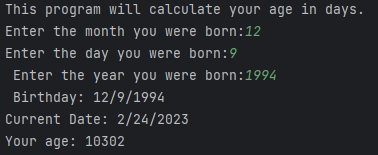

Aloha Eats is a web application designed to help students find foods that are available at the UH Manoa campus. 

While this was not a terribly difficult program to write, it helped refresh my knowledge of C, use of classes, functions, and header files. 

source code: <a href="https://github.com/wsdwight1/agecalc"><i class="large github icon "></i>Age Calculator</a>
