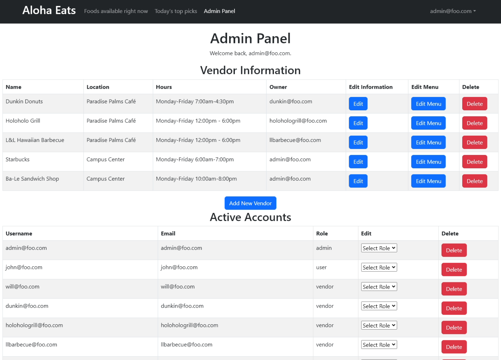

## Overview
Aloha Eats is a web application designed for both vendors and customers in the food industry at UH Manoa. The application focuses on displaying various food items from different vendors, along with the capability for users to set their cuisine and dietary preferences. 

## Key Features
**Food Item Management**: Admin users have the ability to add, edit, or delete food items. Each food item includes details such as name, quantity, cuisine type, availability, and dietary options.

**User Preferences**: Users can set their cuisine and dietary preferences. These preferences are then used to filter the displayed food items, ensuring a personalized experience.

**Vendor Management**: Vendors can manage their information and food items. This includes editing details about their offerings and updating their menus.

**Admin Panel**: A dedicated admin panel is available for administrative tasks. Admins can manage vendor information, update food items, and set top picks for the day.

**Map Integration**: The application includes a map feature that shows the location of various vendors, enhancing the user experience by providing geographical context.

**Filtered Views**: Based on user preferences, the application filters food items. If no preferences are set, the app shows a broader range of items. This ensures that users see food items that align with their tastes and dietary restrictions.

**User Account Management**: Users can create accounts, log in, and manage their profiles. This includes setting preferences for cuisines and dietary restrictions. There is also a user profile page, where user's can update their information and add an image. 

source code: <a href="https://github.com/ManoaMunchies"><i class="large github icon "></i>Project Page</a>
