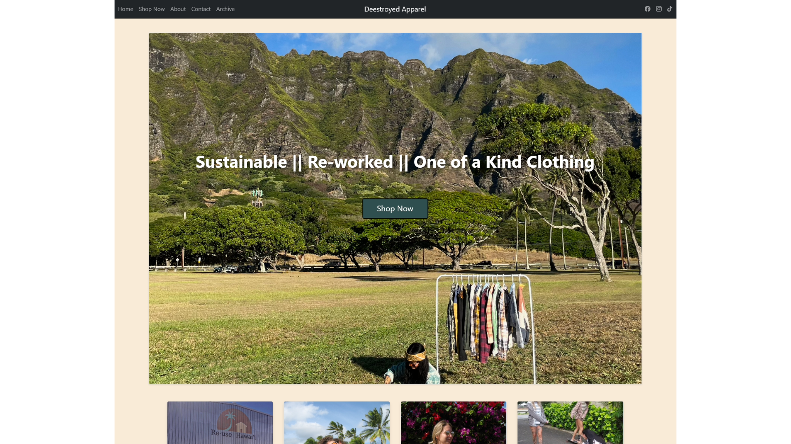

I designed this website, <a href="https://deestroyedapparel.store">Deestroyedapparel.store</a> over the past month for my girlfriend's clothing business. The website is built with Bootstrap 5 along with some javascript to support the Shopify integration. I coded the project in intelliJ, and used the shopify "buy button" app, which produces code for a simple button and manages the cart and checkout. I modified the code to fit the styling for the website, and for different products on the pages, which are managed in a javascript file.   

The website features a home page, a shop index page, three pages for each product category, an about page, an archive page, and a contact page. The contact page includes a simple form that sends an email, which is done with a PHP script. 

