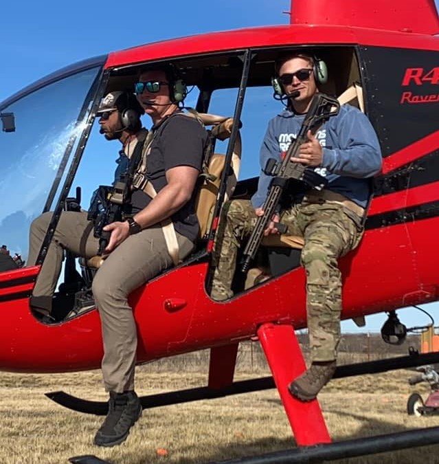

  

In March 2022, I was fortunate enough to participate as an active duty representative for my unit in the Army at a Veteran Fundraiser. Two of my buddies and I drove from Savannah, GA where I was stationed to Graham, TX. Over the course of three days, we helped teach safety procedures for aerial hog hunting and answered any questions of participants. Hogs are a notoriously invasive species, and we helped erradicate them from local ranch owners while simultaneously raising funds for the Warrior Connection and Warrior Ranch.

Source: <a href="https://visitgrahamtexas.com/event/heli-bacon-helicopter-hog-hunt-fundraiser/"><i class="large github icon "></i>Heli Bacon</a>
